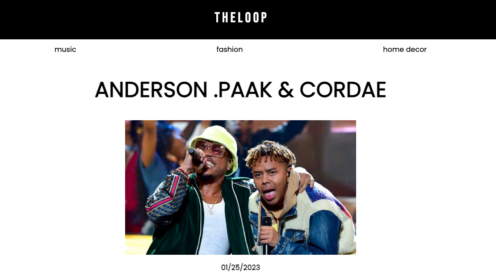
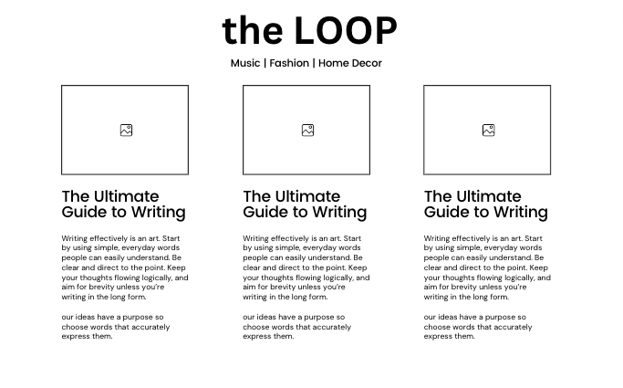
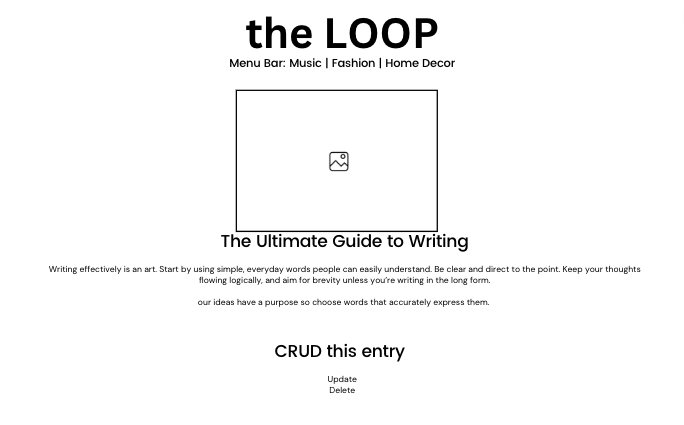

# theLOOP

### theLOOP is a full CRUD web application blog for people who love hella good music, lifestyle fashion and unique home stuff. 

#### 

---
### Technologies Used

I used the following technologies to build this blog: 
1. Django
2. REACT
3. SQL
4. VSCODE
---
### Links

Feel free to [click here to view the live site](https://clever-sunburst-c2fe4a.netlify.app/). You can view additional links below:

- [Trello Board](https://trello.com/b/uXG8y6VI/theloop)
- [Github Frontend](https://github.com/ellzmarie/theLoop-Frontend)
- [Github Backend](https://github.com/ellzmarie/theLoop-Backend)

---
### Entity Relationship Diagram

**Music**

<table>
  <th colspan="2" style="text-align:center">Artist</th>
  <tr>
    <td>id</td>
    <td>primary key</td>
  </tr>
  <tr>
    <td>name</td>
    <td>string</td>
  </tr>
  <tr>
    <td>image</td>
    <td>string</td>
  </tr>
  <tr>
    <td>release_date</td>
    <td>date</td>
  </tr>
  <tr>
    <td>description</td>
    <td>string</td>
  </tr>
    <tr>
    <td>category</td>
    <td>string</td>
  </tr>
  <tr>
    <td>created_at</td>
    <td>datetime</td>
  </tr>
  <tr>
    <td>updated_at</td>
    <td>datetime</td>
  </tr>
</table>

---
### Wireframes
### 
### 

---
### Future Enhancements 

I would like to continue to work on this project in the future and implement some enhancements to the blog, such as:

1. A search bar on each page.
2. Implement authentication for an admin to edit entries and users to engage through ranking and comments.
3. Integrate Spotify / SoundCloud / Apple Music on the Music page to hear preview of songs. 
4. A ranking system and comments section for engagement.
5. Dark / light mode.
